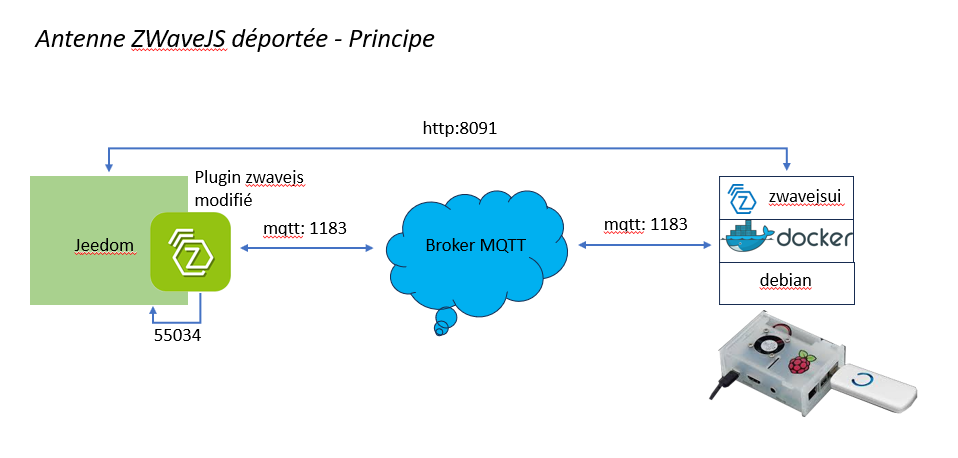
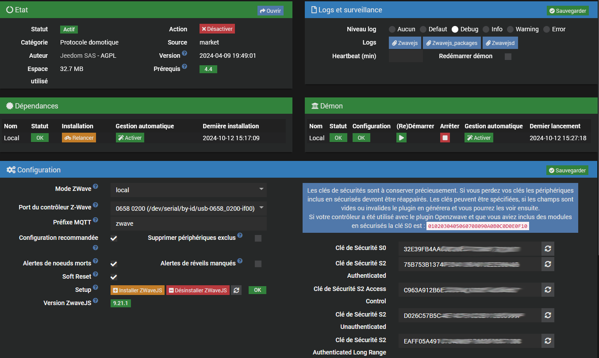
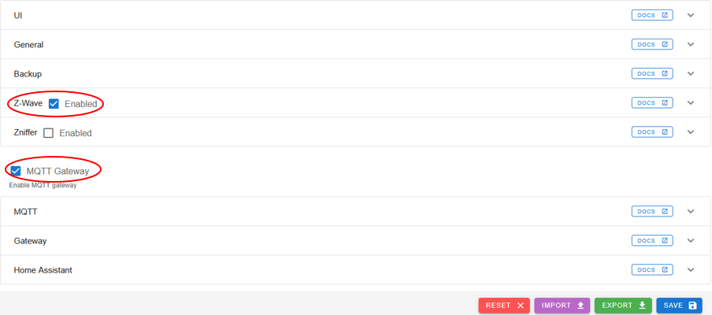
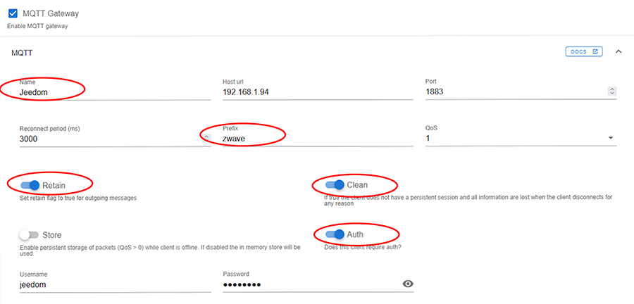
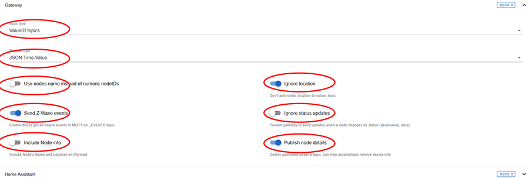
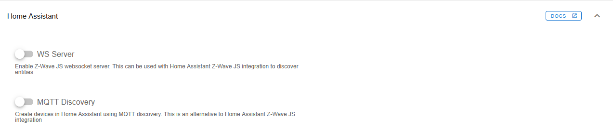
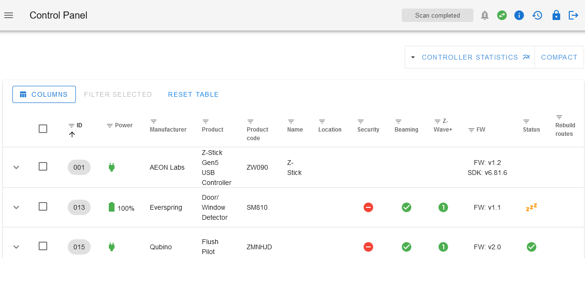
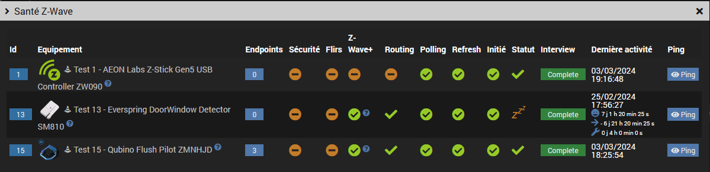
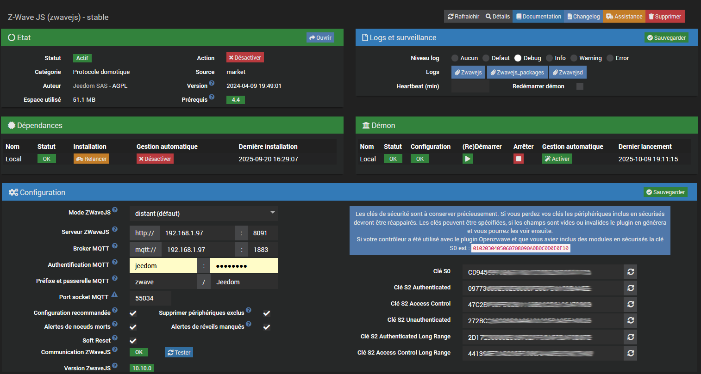

# Plugin Zwave-Js


Version améliorée du plugin officiel [zwavejs](https://github.com/jeedom/plugin-zwavejs) avec option antenne ZWaveJS distante ou locale.
<br>
Le plugin a été testé avec une antenne docker mais il doit également fonctionner avec un container lxc ou une install yarn.
Il ne nécessite plus le plugin `mqtt2`. 

- [Principe de fonctionnement](#principe-de-fonctionnement)
- [Installation](#installation)
- [Mode local](#mode-local)
- [Mode distant](#mode-distant)

	- [Option1: installation depuis le plugin officiel](option1-installation-depuis-le-plugin-officiel)
	- [Option2: paramétrage d'une antenne existante](option2-parametrage-d-une-antenne-existante)
	- [Installation de l'image sur le serveur distant](installation-de-l-image-sur-le-serveur-distant)
	- [Démarrage et arrêt du container ZWaveJS](demarrage-et-arret-du-container-zwavejs)
	- [Vérification du service ZWaveJS et lancement du plugin](verification-du-service-zwavejs-et-lancement-du-plugin)
	
- [Paramètrage du plugin](#parametrage-du-plugin)	
- [FAQ et dépannage](#faq-et-depannage)
- [Changelog](#changelog)

## Principe de fonctionnement  

Ce fork du plugin officiel permet de dissocier l'antenne avec la lib `zwavejsui` de jeedom avec son plugin, cf le schéma plus bas. 
L'antenne ZWaveJS comme le broker peuvent être déployés sur n'importe quelle machine, VM ou docker, local ou pas.
L'installation se fait par défaut en mode distant mais le mode local existe toujours pour des raisons de compatibilité.  



## Installation

```
$ cd /var/www/html/plugins
$ sudo git clone https://github.com/lxrootard/zwavejs.git
$ sudo chown -R www-data:www-data zwavejs
```
## Mode local
Attention l'installation des dépendances n'installe plus la librairie `zwave-js-ui`, il faut utiliser le bouton `ìnstaller ZwaveJS`. 
<br>La version `zwave-js-ui` qui sera installée et le préfixe MQTT par défaut se trouvent dans le fichier `core/config/zwavejs.config.ini`

L'installation se lance en tâche de fond et prend un certain temps. Vous pouvez vérifier le statut avec le bouton `rafraichir`
<br> L'avancement de l'installation se trouve dans le fichier de log `zwavejs_packages`. 
<br> Le voyant doit être vert et à OK et la version doit s'afficher en dessous une fois l'installation terminée.



<p>

Le fonctionnement est identique à celui du plugin officiel. Pour plus d'infos voir la [doc](https://doc.jeedom.com/fr_FR/plugins/automation%20protocol/zwavejs) du plugin ZWaveJS

## Mode distant (non managé)
Ce mode est réservé aux utilisateurs expérimentés sachant utiliser la ligne de commande. 
Le déploiement du docker distant est à effectuer manuellement.

### Option1: installation depuis le plugin officiel

Procédure à suivre si vous avez déjà le plugin officiel `zwavejs` et que vous souhaitez déporter l'antenne en gardant vos settings Jeedom.

Copier et extraire l'archive générée `data/remote/docker_config.tar.gz` dans un répertoire local sur la machine distante ex:

	remote$ sudo mkdir -p /root/store/zwavejs
	remote$ cd /root/store/zwavejs
	remote$ sudo tar xvfz /tmp/docker_config.tar.gz

<p>Vous devez obtenir l'arborescence suivante sur la machine distante:

	/root/store/zwavejs/config.json
	/root/store/zwavejs/config/

<p>Optionnel: copier et utiliser le script `resources/zwavejs` sur la machine distante pour gérer le container

### Option2: paramétrage d'une antenne existante

Procédure à suivre si vous voulez vous connecter à une antenne existante préalablement déployée.

Modifiez le paramétrage de l'antenne via l'interface `zwavejsui > Settings` avec les valeurs suivantes:






Attention! Les settings en <span style="color:red">rouge</span> sont ceux qui sont attendus par le plugin, sans changement ca ne fonctionnera pas. 
<br>Le préfixe et le nom de la gateway MQTT peuvent être changés dans la page de configuration du plugin: `zwave` et `Jeedom` par défaut.

### Installation de l'image sur le serveur distant

Si elle n'est pas déjà présente installer l'image `zwave-js-ui` sur le docker distant:

	remote$ sudo docker pull zwavejs/zwave-js-ui
	
ou installation + démarrage du container:
	
	remote$ sudo zwavejs start

### Démarrage du container ZWaveJS et lancement du plugin

	remote$ sudo zwavejs 
	usage: zwavejs {start|stop|restart|status}

Si vous utilisez un répertoire local différent de `/root/store/zwavejs` modifiez le dans le script

### Vérification du service ZWaveJS et lancement du plugin

Connectez-vous sur `http://remote-ip:8091`

* Login: admin
* Password: zwave

Au bout de quelques secondes le driver doit passer à `Connected` (icône rond vert) et le statut à `Scan completed` 



Mettez à jour le paramétrage du plugin, cf section [paramétrage](#parametrage-du-plugin) plus bas.
<br>Vous pouvez maintenant démarrer votre deamon Jeedom puis vérifier que les infos remontent:



## Paramètrage du plugin
Page de configuration:

* Serveur ZWaveJS: adresse IP et port du service de l'antenne distante (docker ou pas). Port par défaut: 8091
* Broker MQTT: adresse IP et port du service MQTT (distant ou pas). Port par défaut: 1883
* Authentification MQTT: utilisateur et mot de passe du broker.
* Préfixe et passerelle MQTT: topics entrant et sortant utilisés. Défaut: `zwave` et `Jeedom`. <br>Attention pas d'espaces!
* Port socket MQTT: port du callback Jeedom, ne pas modifier sauf conflit.
* Communication ZWaveJS et bouton `Tester`: vert si le service distant est démarré et disponible
* Version ZWaveJS: version du service distant

Vérifiez la communication en cliquant sur le bouton `Tester` 
<br>Le voyant `communication` doit passer au vert:



<br>Note: La version se mettra à jour après démarrage du deamon

### FAQ et dépannage
* Le voyant communication est NOK le démon ne démarre pas
<br>Commencez par vérifier si l'antenne fonctionne, cf section [Vérification du service ZWaveJS](#verification-du-service-zwavejs-et-lancement-du-plugin)
<br>Vérifiez également les adresses IP et ports utilisés pour le broker et l'administration de l'image `zwavejsui`. 
<br>Si vous avez installé avec l'option2 vérifiez que vous avez bien copié l'ensemble des paramètres présents dans l'IHM d'administration de l'image vers celle de jeedom.

* Le voyant communication est OK mais les commandes ne fonctionnent pas 
<br> Vérifiez que les topics sont identiques notamment pour le sortant (pas de contrôle automatique). 
<br>Si vous avez installé avec l'option1 vous devez retouver votre paramétrage dans l'IHM de l'image, si vous avez pris l'option2 il faut vérifier coté Jeedom.

* Si ca ne suffit pas comparez les 2 fichiers de configuration `zwavejs/data/store/settings.json` et `/root/store/zwavejs/config.json`

## Changelog
* v3.6 [lxrootard](https://github.com/lxrootard)
<br> - update upstream: groups, broken graphs, i18n
* v3.5 [lxrootard](https://github.com/lxrootard)
<br> - merge ripleyXLR8:fix/remote-daemon-robustness + corrections diverses
* v3.4 [lxrootard](https://github.com/lxrootard)
<br> - update upstream: custom pictures + config files
* v3.3 [lxrootard](https://github.com/lxrootard)
<br> - modularization
* v3.2 [lxrootard](https://github.com/lxrootard)
<br> - documentation update + code optimization
* v3.1 [lxrootard](https://github.com/lxrootard)
<br> - dependancy fix for Jeedom 4.5 + bugfix
* v3 [lxrootard](https://github.com/lxrootard)
<br> - Suppression de la dépendance au plugin mqtt2
<br> - Ajout d'un onglet pour les commandes ZWaveJS et filtres sur les commandes
<br> - Mise à jour des devices supportés
<br> - Bugfix
* v2 [lxrootard](https://github.com/lxrootard)
<br> - Mode distant pour le serveur ZWaveJS (docker ou lxc)
